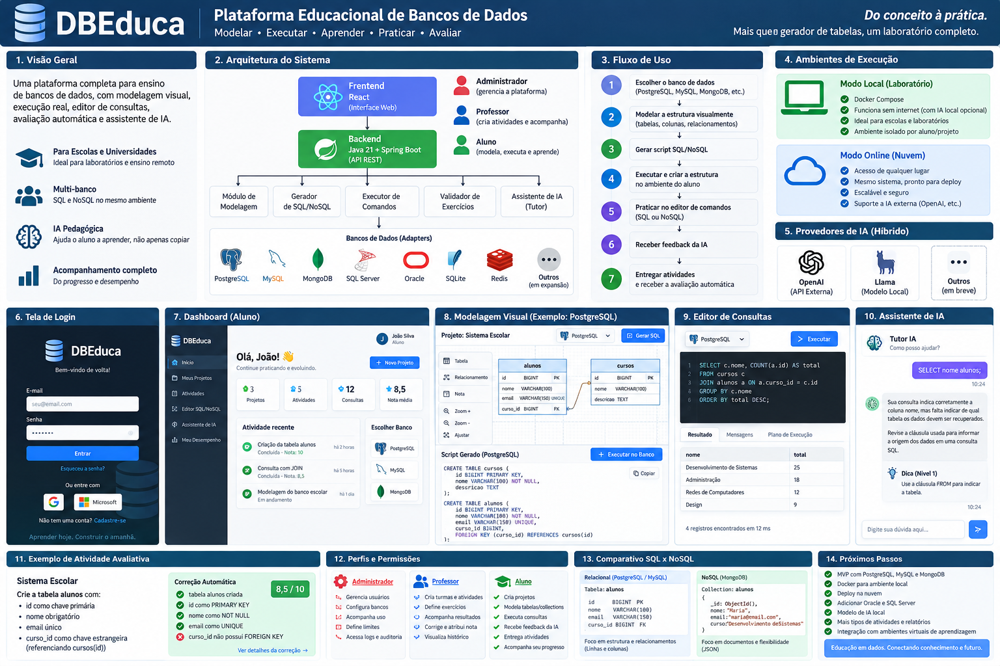

<div align="center">

# DBEduca

### Plataforma educacional para aprender Banco de Dados na prática

Modelagem visual • SQL • NoSQL • geração de scripts • laboratório multi-banco


</div>

---

## Sobre o projeto

O **DBEduca** é uma plataforma educacional criada para aproximar o ensino de banco de dados da prática profissional.

A proposta é permitir que o aluno escolha uma tecnologia, modele a estrutura de dados e visualize o script correspondente, aprendendo conceitos como tabelas, collections, tipos de dados, chave primária, restrições e diferenças entre bancos relacionais e NoSQL.

O projeto foi desenhado para evoluir de um gerador didático de scripts para um **laboratório educacional completo**, com execução controlada, editor SQL/NoSQL, atividades, correção automática, acompanhamento do professor e tutor de IA.

> **Status atual:** MVP 0.1 — geração e validação de scripts. A execução arbitrária de comandos enviados pelo navegador ainda não faz parte desta versão.

---

## Objetivos

- tornar o estudo de Banco de Dados mais visual e prático;
- permitir comparação entre diferentes engines;
- gerar SQL/NoSQL a partir da estrutura definida pelo aluno;
- oferecer uma arquitetura extensível para novos bancos;
- preparar um ambiente seguro para execução de exercícios em laboratório;
- evoluir para uma plataforma com perfis de Administrador, Professor e Aluno.

---

## Funcionalidades disponíveis no MVP 0.1

- seleção entre **PostgreSQL**, **MySQL** e **MongoDB**;
- definição de tabela ou collection;
- criação dinâmica de campos;
- configuração de `PRIMARY KEY`;
- configuração de `NOT NULL`;
- configuração de `UNIQUE`;
- geração de DDL para PostgreSQL;
- geração de DDL para MySQL;
- geração de scripts para MongoDB;
- validação de identificadores no backend;
- interface React com tema claro/escuro;
- API REST em Spring Boot;
- Docker Compose com PostgreSQL, MySQL e MongoDB;
- testes unitários do núcleo e testes MVC da API.

---

## Arquitetura



```text
┌──────────────────────────────┐
│          React 19            │
│      Interface do aluno      │
└──────────────┬───────────────┘
               │ HTTP/JSON
               ▼
┌──────────────────────────────┐
│ Java 21 + Spring Boot 3.5.5  │
│          REST API            │
└──────────────┬───────────────┘
               │
               ▼
┌──────────────────────────────┐
│   ScriptGeneratorRegistry    │
└───────┬─────────┬────────────┘
        │         │
        │         │
        ▼         ▼           ▼
  PostgreSQL    MySQL      MongoDB
   Adapter      Adapter      Adapter
```

O contrato `ScriptGenerator` desacopla o domínio das engines específicas. Essa abordagem permite adicionar Oracle, SQL Server, SQLite, Redis e outras tecnologias sem reescrever a camada web.

---

## Stack tecnológica

### Backend

- Java 21;
- Spring Boot 3.5.5;
- Spring Web;
- Spring Boot Actuator;
- Maven;
- JUnit 5;
- testes MVC da API.

### Frontend

- React 19;
- Vite;
- JavaScript;
- CSS responsivo;
- tema Light/Dark.

### Bancos de dados

- PostgreSQL;
- MySQL;
- MongoDB.

### Infraestrutura

- Docker;
- Docker Compose;
- Nginx para o frontend containerizado.

---

## Estrutura do repositório

```text
DBEduca/
├── backend/
│   ├── pom.xml
│   ├── Dockerfile
│   └── src/
│
├── frontend/
│   ├── package.json
│   ├── Dockerfile
│   ├── nginx.conf
│   └── src/
│
├── docs/
│   ├── assets/
│   └── superpowers/
│
├── docker-compose.yml
├── .env.example
├── start.ps1
└── README.md
```

---

## Como executar

### Opção 1 — Docker Compose

Na raiz do projeto:

```powershell
Copy-Item .env.example .env
docker compose up --build
```

Ou utilize o atalho:

```powershell
.\start.ps1
```

Serviços esperados:

| Serviço | Endereço |
|---|---|
| Frontend | `http://localhost:3000` |
| Backend | `http://localhost:8080` |
| Actuator Health | `http://localhost:8080/actuator/health` |

### Bancos do laboratório

| Banco | Host | Porta externa | Database | Usuário padrão |
|---|---|---:|---|---|
| PostgreSQL | `localhost` | `55432` | `dbeduca_lab` | `dbeduca` |
| MySQL | `localhost` | `53306` | `dbeduca_lab` | `dbeduca` |
| MongoDB | `localhost` | `57017` | `admin` | `dbeduca` |

> As credenciais do arquivo `.env.example` são destinadas ao ambiente local de desenvolvimento. Altere-as antes de qualquer publicação.

---

## Executar manualmente

### Backend

Requisitos:

- JDK 21 ou superior com suporte a `--release 21`;
- Maven 3.9+.

```powershell
cd backend
mvn clean spring-boot:run
```

Para verificar a aplicação:

```powershell
Invoke-RestMethod http://localhost:8080/actuator/health
```

Resposta esperada:

```text
status
------
UP
```

### Frontend

Requisito: Node.js 22+.

```powershell
cd frontend
npm install
npm run dev
```

Acesse:

```text
http://localhost:5173
```

---

## API REST

### Listar engines suportadas

```http
GET /api/v1/platform/engines
```

### Gerar script

```http
POST /api/v1/scripts/generate
Content-Type: application/json
```

Exemplo:

```json
{
  "engine": "POSTGRESQL",
  "tableName": "alunos",
  "columns": [
    {
      "name": "id",
      "type": "BIGINT",
      "primaryKey": true,
      "notNull": true,
      "unique": false
    },
    {
      "name": "nome",
      "type": "VARCHAR(100)",
      "primaryKey": false,
      "notNull": true,
      "unique": false
    }
  ]
}
```

---

## Exemplo didático

Estrutura definida pelo aluno:

```text
Tabela: alunos

id       BIGINT        PRIMARY KEY
nome     VARCHAR(100)  NOT NULL
email    VARCHAR(150)  UNIQUE
```

Saída PostgreSQL/MySQL equivalente:

```sql
CREATE TABLE alunos (
    id BIGINT PRIMARY KEY,
    nome VARCHAR(100) NOT NULL,
    email VARCHAR(150) UNIQUE
);
```

No MongoDB, o mesmo domínio pode ser representado por uma collection e documentos, permitindo que o aluno compare os modelos relacional e documental.

---

## Testes

Execute os testes do backend com:

```powershell
cd backend
mvn test
```

O núcleo de geração de scripts possui baixo acoplamento com o Spring para facilitar testes rápidos e evolução dos adapters.

---

## Segurança pedagógica

O navegador não deve receber credenciais dos bancos nem possuir acesso direto às instâncias de PostgreSQL, MySQL ou MongoDB.

A evolução do laboratório seguirá princípios como:

- isolamento por aluno/projeto;
- timeout de execução;
- limite de linhas retornadas;
- bloqueio de operações perigosas;
- quotas;
- auditoria;
- histórico de comandos;
- validação no backend.

---

## Roadmap

### Sprint 2 — Laboratório de execução

- [ ] execução controlada no PostgreSQL;
- [ ] execução controlada no MySQL;
- [ ] execução controlada no MongoDB;
- [ ] isolamento por projeto/aluno;
- [ ] editor SQL/NoSQL;
- [ ] timeout e limite de resultados;
- [ ] histórico de execução.

### Sprint 3 — Plataforma educacional

- [ ] autenticação;
- [ ] Spring Security + JWT;
- [ ] RBAC com `ADMIN`, `PROFESSOR` e `ALUNO`;
- [ ] turmas;
- [ ] atividades;
- [ ] correção automática;
- [ ] notas;
- [ ] histórico de tentativas.

### Sprint 4 — Tutor de IA híbrido

- [ ] provider de IA externo;
- [ ] provider local;
- [ ] níveis de ajuda de 1 a 4;
- [ ] análise da tentativa do aluno;
- [ ] modo prova configurável;
- [ ] auditoria do uso da IA.

### Sprint 5 — Expansão de engines

- [ ] Oracle;
- [ ] SQL Server;
- [ ] SQLite;
- [ ] Redis;
- [ ] Cassandra.

---

## Visão de evolução

```text
MVP 0.1
Gerar scripts
     ↓
Sprint 2
Executar em ambiente controlado
     ↓
Sprint 3
Professor + Aluno + Administrador
     ↓
Sprint 4
Tutor pedagógico de IA
     ↓
Sprint 5
Plataforma multi-engine ampliada
```

---

## Público-alvo

- estudantes de Desenvolvimento de Sistemas;
- cursos técnicos;
- professores de Banco de Dados;
- escolas e instituições de ensino;
- estudantes iniciantes em SQL e NoSQL;
- pessoas que desejam comparar diferentes tecnologias de persistência.

---

## Contribuição

O DBEduca está em evolução. Sugestões, issues e pull requests podem contribuir para novos exercícios, adapters, validações e recursos pedagógicos.

---

## Autor

**Jucelio Farias Coelho**

Projeto desenvolvido com foco em educação tecnológica, prática de Banco de Dados e construção de uma plataforma extensível para ensino de SQL e NoSQL.

---

<div align="center">

**DBEduca — do conceito à prática.**

</div>
